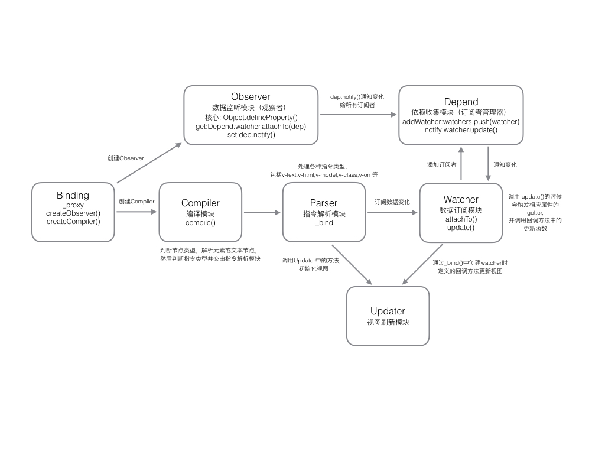

# Binding

轻量级 MVVM 库

### Build

```
gulp
```

### 技术基础

实现数据绑定：

- 普通绑定 [实例](example/ancient-binding.html)
- 脏值检测（Angular.js）[实例](example/dirty-check-binding.html)
- 使用 `Object.defineProperty()` 进行数据劫持（Vue.js）[实例](example/hijack-binding.html)

### Q&A  

[Q&A](QA.md)          
            
### 模块划分




