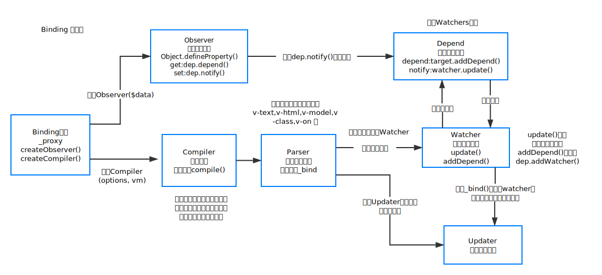

# Binding

### 技术基础

实现数据绑定：

- 普通绑定 [实例](example/ancient-binding.html)
- 常见的数据绑定的实现有脏值检测（Angular.js）[实例](example/dirty-check-binding.html)
- 基于 ES5 的 getter和setter 进行数据劫持（Vue.js）[实例](example/hijack-binding.html)

### 实现思路

- 实现一个 Compiler 对元素的每个节点进行指令的扫描和提取；
- 实现一个 Parser 去解析元素上的指令，把指令的意图通过 Updater 更新到 DOM 上
- 实现一个 Watcher 能将 Parser 中每条指令的刷新函数和对应 Model 的字段联系起来；
- 实现一个 Observer 对对象的的变化进行监测，发生变化时可以触发通知回调；

### 模块划分

